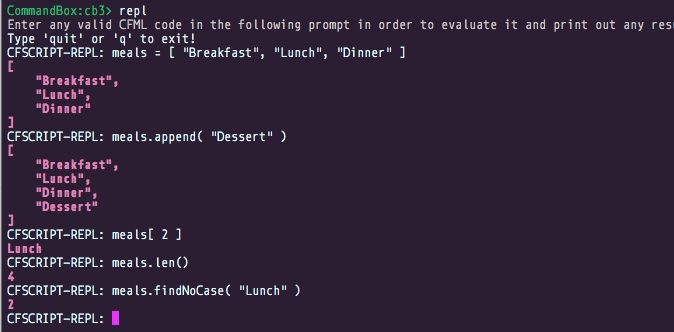

# Arrays

Almost every programming language allows you to represent different types of collections. In CFML we have two types of collections: arrays and structures.

An array is a number-indexed list. Imagine you had a blank piece of paper and drew a set of three small boxes in a line:

```text
 ---  ---  ---
|   ||   ||   |
 ---  ---  ---
```

You could number each one by its position left to right:

```text
 ---  ---  ---
|   ||   ||   |
 ---  ---  ---
  1    2    3
```

Then put strings in each box:

```text
 -------------  ---------  ----------
| "Breakfast" || "Lunch" || "Dinner" |
 -------------  ---------  ----------
       1            2           3
```

We have a three element Array. CFML arrays can grow and shrink dynamically at runtime just like Array Lists or Vectors in Java, so if we added an element it’d usually go on the end or appended at the end.

```text
 -------------  ---------  ----------  -----------
| "Breakfast" || "Lunch" || "Dinner" || "Dessert" |
 -------------  ---------  ----------  -----------
       1            2           3           4
```

If you asked the array for the element in position two you’d get back `Lunch`. Ask for the last element and you’d get back `Dessert`.

## The Story of One

Now, have you detected something funny with the ordering of the elements? Come on, look closer....... They start with `1` and not `0`, now isn't that funny. CFML is one of the few languages where array indexes start at `1` and not `0`. So if you have a PHP, Ruby or Java background, remember that `1` is where you start.


All CFML arrays in Adobe ColdFusion are passed by values, while in Lucee they are passed by reference. Please keep this in mind when working with arrays and passing them to functions. There is also the passby=reference\|value attribute to function arguments where you can decide if you want to pass by reference or value.


## Arrays in Code

Let's go ahead and model some code in CFML using our fancy REPL tool CommandBox:



Check it out:

* The array was created by putting pieces of data between square brackets \(`[]`\) and separated by commas
* We added an element to the array using the member function `append()`
* We fetched the element at a specific position by using square brackets \(`[ x ]`\) and replaced `x` with the index we wanted
* We retrieved the size of the array by using the member function `len()`
* We searched the contents of the array using the member function `findNoCase()` and it gave us the index position of the element in the array.

Please note that all member functions can also be used as traditional [array functions](https://cfdocs.org/array-functions). However, [member functions](https://cfdocs.org/member) do look so much better for readability.


**Tip:** You can use the toString\(\) call on any array to get a string representation of its values: grid.toString\(\)


## Multi-Dimensional Arrays

If you would like to create grids or matrix constructs you will have to create two-dimensional arrays. Basically giving you and x and y axis of data. You will do so using the `arrayNew( dimensions = max 3 )` method:

```javascript
grid = arrayNew( 2 );
grid[ 1 ][ 1 ] = 'Hammer';
grid[ 1 ][ 2 ] = 'Nail';
grid[ 2 ][ 1 ] = 'Screwdriver';
grid[ 1 ][ 2 ] = 'Screw';
```


**Tip:** CFML only supports of two three dimensional arrays, so you can easily represent x, y and z axis.


## Common Methods

The best way to learn about using arrays is to check out the available [member functions](https://cfdocs.org/member) and [array functions](https://cfdocs.org/array-functions).

```javascript
// Sort an array
meals.sort( "textnocase" );

// Clear the array
meals.clear();

// Go on a diet
meals.delete( "Dessert" );
meals.deleteAt( 4 );

// Iterate
meals.each( function( element, index) {
   systemOutput( element & " " & index );
} );

// Filter an array
meals.filter( function( item ){
 return item.findNoCase( "unch" ) gt 0 ? true : false;
} );

// Convert to a list
meals.toList();

// Map/ Reduce
complexData = [ {a: 4}, {a: 18}, {a: 51} ];
newArray = arrayMap( complexData, function(item){
   return item.a;
});
writeDump(newArray);


complexData = [ {a: 4}, {a: 18}, {a: 51} ]; 
 sum = arrayReduce( complexData, function(prev, element) 
 { 
 return prev + element.a; 
 }, 0 ); 
writeDump(sum);
```

## Looping Over Arrays

You can use different constructs for looping over arrays:

* `for` loops
* `loop` constructs
* `each()` closures

```javascript
for( var thisMeal in meals ){
 systemOutput( "I just had #thisMeal#" );
}

for( var x = 1; x lte meals.len(); x++ ){
 systemOutput( "I just had #meals[ x ]#" );
}

meals.each( function( element, index ){
  systemOutput( "I just had #element#" );
} );

cfloop( from=1, to=meals.len(), index=x ){
  systemOutput( "I just had #meals[ x ]#" );
}
```

### Multi-Threaded Looping

As of now only Lucee allows you to leverage the `each()` operations in a multi-threaded fashion.  The `arrayEach()` or `each()` functions allows for a `parallel` and `maxThreads` arguments so the iteration can happen concurrently on as many `maxThreads` as supported by your JVM.

```java
arrayEach( array, callback, parallel:boolean, maxThreads:numeric );
each( collection, callback, parallel:boolean, maxThreads:numeric );
```

This is incredibly awesome as now you callback will be called concurrently!  However, please note that once you enter concurrency land, you should shiver and tremble.  Thread concurrency will be of the utmost importance and you must make sure that var scoping is done correctly and that appropriate locking strategies are in place.

```java
myArray.each( function( item ){
   myservice.process( item );
}, true, 20 );
```

