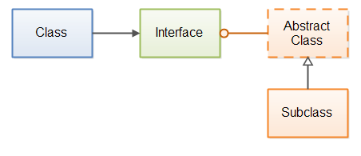
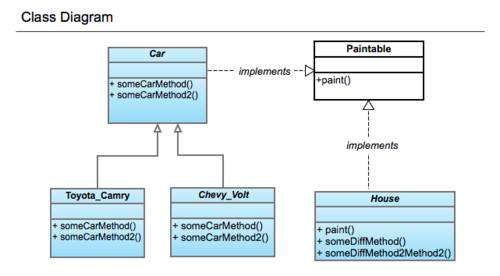

# Interfaces

Interfaces are a type of component that have a set of signatures for specific functions and in some of the latest versions of Lucee and Adobe ColdFusion it can even have some implemented functions.  You can basically call an interface a signature map for the type of components you want to create.  In statically typed languages, they make a lot of sense since they can allow you to add/modify behavior of classes that the compiler can understand on how to link and compile.   In a dynamic language, where functions can mutate or even be removed or injected at runtime, interfaces don't make soooo much sense.  However, interfaces are a great way to provide documented signatures for developers to follow.



If you are developing frameworks, libraries or structured domain models where implementations can be done at a later point of time, or different strategies adapted; interfaces are king.



## Declaration

Interfaces are defined in a file template with a `.cfc` extension.  For best practice you can start the name of the interface with a capital `I,` example: `IAnimal.cfc, ILogger.cfc, IAdapter.cfc`

```java
interface extends="other_interfaces"{

    any function returnAny( required numeric obj, boolean why=false )
    function sayHello()
    
    ILogger function logEvent( required logEvent )
    
    // If in Adobe2018 or Lucee, you can implement default behavior
    function getCacheKey(){
        return "default_key";
    }
}
```

## Implementation

Interfaces can extend other interfaces and components that implement them can also implement many interfaces:

```java
component implements="ILogger,IAdapter"{
    any function returnAny( required numeric obj, boolean why=false ){
        // implementation here.
    }
    function sayHello(){
        return "Hola";
    }
    
    ILogger function logEvent( required logEvent ){
       // log this...
       return this;
    }
}
```


