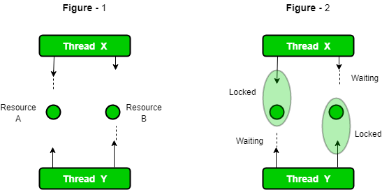

# Code Locking

Locking is an essential piece of software engineering.  There are occasions where shared resources must be locked in order to write to them or read from them.  This process of locking can be very simple or extremely complex.  Sometimes it can lead to deadlocks and serious concurrency issues.  Further to say, we will only cover basic usage of the locking constructs in CFML.


You can find an in-depth article on locking here: [https://helpx.adobe.com/coldfusion/developing-applications/developing-cfml-applications/using-persistent-data-and-locking/locking-code-with-cflock.html](https://helpx.adobe.com/coldfusion/developing-applications/developing-cfml-applications/using-persistent-data-and-locking/locking-code-with-cflock.html)

You can also find great knowledge in the Java Synchronization tutorial: [https://docs.oracle.com/javase/tutorial/essential/concurrency/sync.html](https://docs.oracle.com/javase/tutorial/essential/concurrency/sync.html)


## cflock

CFML gives you the `cflock` tag/construct which you can use to ensure the integrity of shared data and it allows you to have two types of locks:

1. **Exclusive** - Allows single-thread access to the CFML constructs in its body. The tag body can be executed by **one** request at a time. No other requests can start executing code within the tag while a request has an exclusive lock. ColdFusion issues exclusive locks on a first-come, first-served basis.
2. **ReadOnly** - Allows multiple requests to access CFML constructs within the tag body concurrently. Use a read-only lock only when shared data is read and not modified. If another request has an exclusive lock on shared data, the new request waits for the exclusive lock to be released

Apart from the type of lock, you can also have two different locking strategies:

1. **Named Locking** : Where a name is used to identify the locking construct
2. **Scoped Locking**: Where you will lock access to a specific CFML scope.

```java
lock 
    type="exclusive|readOnly"
    timeout="15" 
    name="mylock" 
    scope="application|server|session|request"
    throwOnTimeout="true|false"
{
     // Your code that is synchronized goes here   
}
```

### Attributes

Here are the attributes to the `cflock` construct

| Attribute | Type | Default | Description |
| :--- | :--- | :--- | :--- |
| `timeout` | numeric | `required` | Max length in seconds to wait to obtain the lock.  If lock is obtained, tag execution continues. Otherwise, behavior depends on throwOnTimeout attribute value. |
| `scope` | string |  | Lock scope. Mutually exclusive with the `name` attribute. Only one request in the specified scope can execute the code within this tag \(or within any other cflock tag with the same lock scope scope\) at a time.  Values are: `application, request, server, session` |
| `name` | string |  |  Lock name. Mutually exclusive with the scope attribute.  Only one request can execute the code within a `cflock` tag  with a given name at a time. Cannot be an [empty](https://cfdocs.org/empty) string. |
| `throwOnTimeout` | boolean | true | If true and a timeout is reached an exception is thrown, else it is ignored. |
| `type` | string | exclusive | **readOnly**: lets more than one request read shared data. **exclusive**: lets one request read or write shared data. |


**Important**: Please note that when using named locks, the name is shared across the entire ColdFusion server, no matter the `cfapplication` it is under.  Please be aware of it and use unique enough names.  Lock names are global to a ColdFusion server. They are shared among applications and user sessions, but not clustered servers.


## Named Locking

Named locking is the easiest, where access to the construct is by name.  Lock names are global to a ColdFusion server. They are shared among applications and user sessions, but not clustered servers.  

```java
lock name="cache-population-myapp" timeout=10 type="exclusive"{
    myData = myservice.getData();
    cache.set( "mykey", myData );
}
```

## Scoped Locking

Scoped locking will allow you to lock access to a specific CFML scope like: `application, server, session and request.`  You usually do this to synchronize access to variables placed within those scopes.  In all essence, scope locking is expensive as it is a BIG lock around the entire scope access.  I would suggest to stick to named locks so you can have pin-point accuracy when dealing with code synchronization.  Remember that locking can be expensive.

```java
lock scope="application" timeout="15"{
    application.myNumber += 5;
}

lock scope="application" timeout="20" type="readonly"{
    writeOutput( "I have #application.number# of sock(s) in my closet" );
}
```


I highly discourage the use of scope locks as it throws a huge locking mechanism around the entire scope access.  Tread with caution.


## Deadlocks



A deadlock is a state in which no request can execute the locked construct. After a deadlock occurs, neither thread can break it, because all requests to the protected section of the lock are blocked until the deadlock can be resolved by a lock time-out.

The `cflock` tag/construct uses kernel level synchronization objects that are released automatically upon time out and/or the abnormal termination of the thread that owns them. Therefore, while processing a `cflock` , the server never deadlocks for an infinite period. However, large time-outs can block request threads for long periods, and radically decrease throughput. 

To. prevent this, always use the minimum time-out value. Another cause of blocked request threads is inconsistent **nesting** of `cflocks`  and inconsistent naming of locks. If you nest locks, everyone accessing the locked variables must consistently nest `cflocks`  in the same order. Otherwise, a deadlock can occur. 

More information can be found here: [https://helpx.adobe.com/coldfusion/cfml-reference/coldfusion-tags/tags-j-l/cflock.html](https://helpx.adobe.com/coldfusion/cfml-reference/coldfusion-tags/tags-j-l/cflock.html)

## Race Conditions: Double Locking

There will be cases where race conditions will exist and multiple threads will be waiting for access into a lock body construct.  Furthermore, you will want that only ONE thread enters the body construct and does something and the rest get ignored.  This is a race condition and it must be treated with a double lock approach.  What this does is that it evaluated the condition of your body \(business logic\) and if available then enters the lock.

Let's do a simple example where you only want ONE thread to ever populate the cache with data and return it from a function.  Let's see how NOT to do it first:

```java
function loadData(){
    var myData = cache.get( "mykey" );
    
    if( isNull( myData ) ){
        lock name="cache-population-myapp" timeout=10 type="exclusive"{
            myData = myservice.getData();
            cache.set( "mykey", myData );
        }
    }
    
    return myData;
}
```

I am sure that you see this nice function and you are like, well yep it is correct!  We check for the existence of the cached data, if null, we load it up and return it.  WROOONG!!!  This can lead to race conditions where if multiple threads are ALREADY waiting within the lock area, multiple threads can set and re-set the cached data. If we really ONLY want one thread to set the data, we must do a double lock approach:

```java
function loadData(){
    var myData = cache.get( "mykey" );
    
    if( isNull( myData ) ){
        lock name="cache-population-myapp" timeout=10 type="exclusive"{
            if( !cache.exists( "mykey" ) ){
                myData = myservice.getData();
                cache.set( "mykey", myData );
            } else {
                return cache.get( "mykey" );
            }
        }
    }
    
    return myData;
}
```

