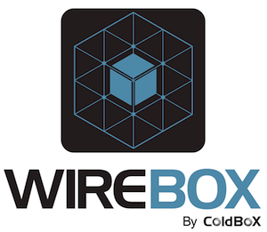

# Dependency Injection

> Dependency injection is the art of making work come home to you.  
> Dhanji R. Prasanna

**In ColdFusion, WireBox is the standard when it comes to Dependency Injection and Aspect Oriented Programming \(AOP\).**

WireBox alleviates the need for custom object factories or manual object creation in your ColdFusion \(CFML\) applications. It provides a **standardized** approach to object **construction** and **assembling** that will make your code easier to adapt to changes, easier to [test, mock](https://testbox.ortusbooks.com) and extend.


You can read all about WireBox here: [https://wirebox.ortusbooks.com/](https://wirebox.ortusbooks.com/)


As software developers we are always challenged with maintenance and one ever occurring annoyance, **change**. Therefore, the more sustainable and maintainable our software, the more we can concentrate on real problems and make our lives more productive. WireBox leverages an array of metadata annotations to make your object assembling, storage and creation easy as pie! We have leveraged the power of event driven architecture via object listeners or interceptors so you can extend not only WireBox but the way objects are analyzed, created, wired and much more. To the extent that our [AOP]() capabilities are all driven by our AOP listener which decouples itself from WireBox code and makes it extremely flexible.

## Dependency Injection Explained

We have released one of our chapters from our [CBOX202: Dependency Injection](https://www.ortussolutions.com/learn) course that deals with getting started with Dependency Injection, the problem, the benefits and the solutions. We encourage you to download it, print it, share it, digest it and learn it: [http://ortus-public.s3.amazonaws.com/cbox202-unit1-3.pdf](http://ortus-public.s3.amazonaws.com/cbox202-unit1-3.pdf)


If you require any training please [contact us](https://www.ortussolutions.com/learn).


## Advantages of a DI Framework

Compared to manual Dependency Injection \(DI\), using WireBox can lead to the following advantages:

* You will write less boilerplate code.
* By giving WireBox DI responsibilities, you will stop creating objects manually or using custom object factories.
* You can leverage object persistence scopes for performance and scalability. Even create time persisted objects.
* You will not have any object creation or wiring code in your application, but have it abstracted via WireBox. Which will lead to more cohesive code that is not plagued with boilerplate code or factory code.
* Objects will become more testable and easier to mock, which in turn can accelerate your development by using a TDD \(Test Driven Development\), BDD \(Behavior Driven Development\) approach.
* Once WireBox leverages your objects you can take advantage of AOP or other event life cycle processes to really get funky with OO.

## Features at a Glance

Here are a simple listing of features WireBox brings to the table:

* Annotation driven dependency injection
* 0 configuration mode or a programmatic binder configuration approach via ColdFusion \(No XML!\)
* Creation and Wiring of or by:
  * ColdFusion Components
  * Java Classes
  * RSS Feeds
  * WebService objects
  * Constant values
  * DSL string building
  * Factory Methods
  * Providers
* Multiple Injection Styles: Property, Setter, Method, Constructor
* Automatic Package/Directory object scanning and registration
* Multiple object life cycle persistence scopes:
  * No Scope \(Transients\)
  * Singletons
  * Request Scoped
  * Session Scoped
  * Application Scoped
  * Server Scoped
  * CacheBox Scoped
* Integrated caching via [CacheBox](https://cachebox.ortusbooks.com), scale your objects and metadata
* Integrated logging via [LogBox](https://logbox.ortusbooks.com), never try to figure out what in the world the DI engine is doing
* Parent Factories
* Factory Method Object Creations
* Object life cycle events via WireBox Listeners/Interceptors
* Customizable injection DSL
* WireBox object providers to avoid scope-widening issues on time/volatile persisted objects
* [Aspect Oriented Programming]()
* [Standalone ORM Entity Injection]()

## Useful Resources

* [http://code.google.com/p/google-guice](http://code.google.com/p/google-guice)
* [http://www.manning.com/prasanna/](http://www.manning.com/prasanna/)
* [http://en.wikipedia.org/wiki/Aspect-oriented\_programming](http://en.wikipedia.org/wiki/Aspect-oriented_programming)
* [http://en.wikipedia.org/wiki/Dependency\_injection](http://en.wikipedia.org/wiki/Dependency_injection)
* [http://en.wikipedia.org/wiki/Inversion\_of\_control](http://en.wikipedia.org/wiki/Inversion_of_control)
* [http://martinfowler.com/articles/injection.html](http://martinfowler.com/articles/injection.html)
* [http://www.theserverside.com/news/1321158/A-beginners-guide-to-Dependency-Injection](http://www.theserverside.com/news/1321158/A-beginners-guide-to-Dependency-Injection)
* [http://www.developer.com/net/net/article.php/3636501](http://www.developer.com/net/net/article.php/3636501)
* [http://code.google.com/p/google-guice/](http://code.google.com/p/google-guice/)

