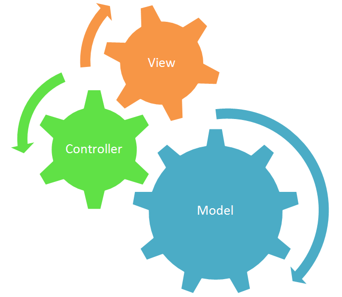
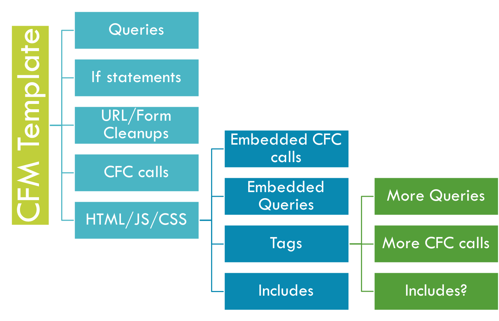
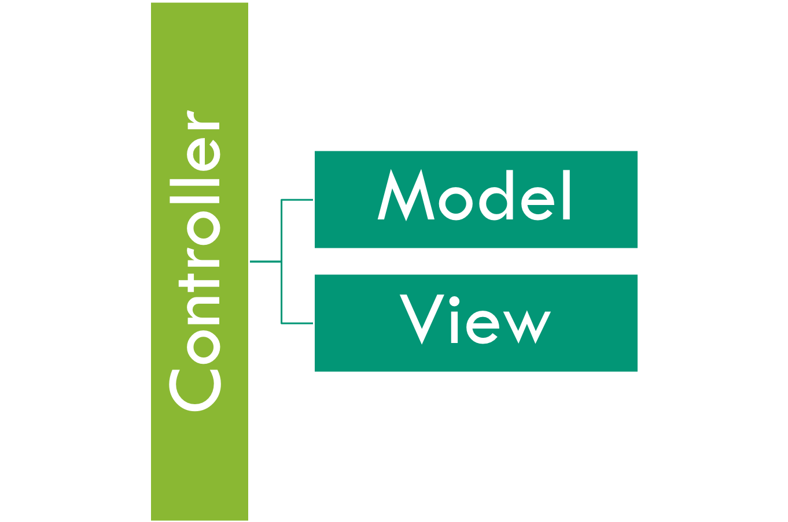
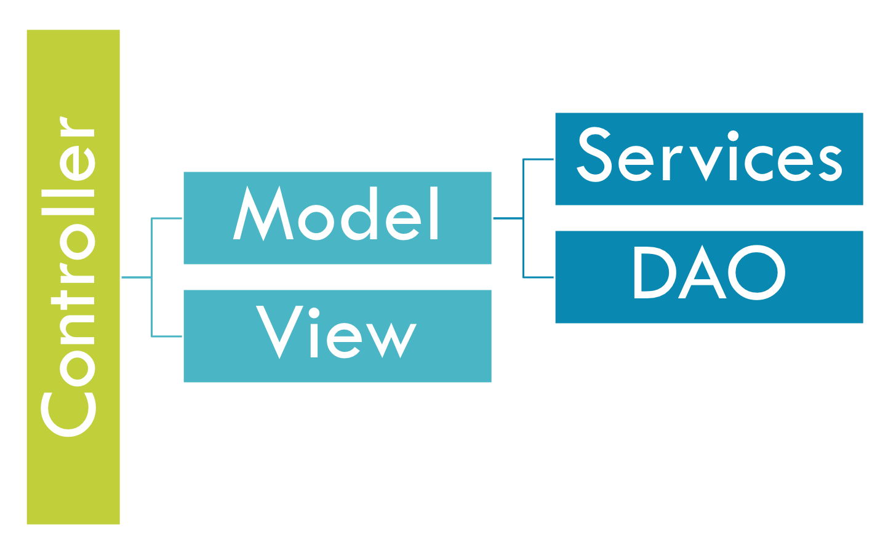
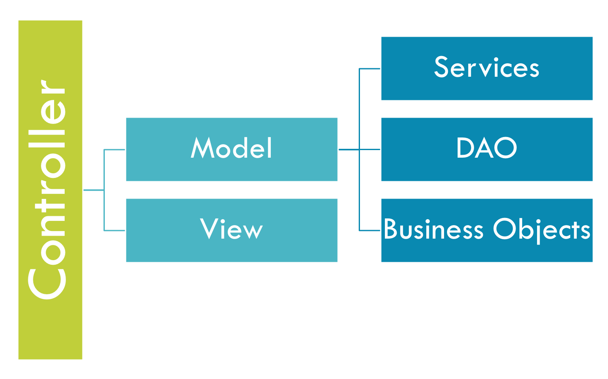
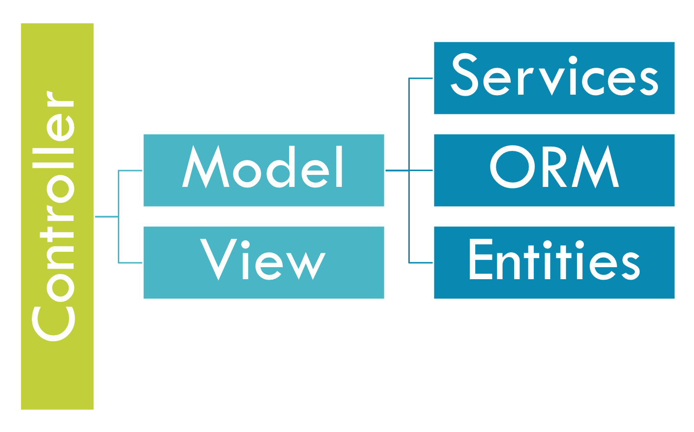

# MVC

## Intro to MVC

> "A developer often wishes to separate data \(model\) and user interface \(view\) concerns, so that changes to the user interface will not affect data handling, and that the data can be reorganized without changing the user interface. The model-view-controller solves this problem by decoupling data access and business logic from data presentation and user interaction, by introducing an intermediate component: the controller." [Wikipedia](http://en.wikipedia.org/wiki/Model-view-controller)​

MVC is a popular design pattern called [Model View Controller](http://en.wikipedia.org/wiki/Model%E2%80%93view%E2%80%93controller) which seeks to promote good maintainable software design by separating your code into 3 main tiers:

* **Model**  - Business Logic, Data, Queries, Etc
* **View** - Representation of your models, queries, data.
* **Controller** - Orchestrator of client request to the appropriate models and views

Let's go a little deeper.

### Model

The Model is the heart of your application. Your business logic should mostly live here in the form of services, beans, entities and DAOs. A dependency injection framework becomes invaluable when dealing with object oriented model layers: [**WireBox**](https://wirebox.ortusbooks.com) \(Dependency Injection Framework\) is the framework of choice for dependency injection and aspect oriented programming.

### Views

The Views are what the users see and interact with. They are the templates used to render your application out for the web browser. Typically this means cfm/HTML, but it can also be JSON, XML, data views, etc. 

In modern times, your views can even be pure HTML with a combination of a JavaScript MVC framework.  The major players in the MVC front-end world that we would recommend in order of personal preference:

* **VueJS** - [https://vuejs.org/](https://vuejs.org/)
* **Angular** - [https://angular.io/](https://angular.io/)
* **ReactJS** - [https://reactjs.org/](https://reactjs.org/)
* **EmberJS** - [https://www.emberjs.com/](https://www.emberjs.com/)

### Controllers

Controllers are the traffic cops of your application. They direct flow control, and interface directly without incoming parameters from FORM and URL scopes. It is the controller’s job to communicate with the appropriate models for processing, and set up either a view to display results or return serialized data like JSON, XML, PDF, etc.

## Benefits of MVC

By implementing an MVC Framework to your applications you will gain several benefits that come inherent to the MVC design pattern.  The most important benefit of MVC is that you will be **separating the presentation** from the model.  This is a very important heuristic of software development as [**separation of concerns**](https://en.wikipedia.org/wiki/Separation_of_concerns) is applied and responsibilities are delegated upon the layers.

### Separation of Concerns

The model and the view layers have different concerns about their implementations.  A view layer is concerned with how to render the data, the type of browser, or remote rendering, etc.  While the model is more concerned with the business rules of the application, how to store data and even database operations.  You use different development approaches to each layer.

### Multiple GUI’s

Due to this separation, you can easily create multiple views for the same model data without affecting how the model works or is coded.  The view layers can adapt to the model by coding their own implementations.  This makes it really easy to create multiple GUI’s for applications.

### Unit and Behavioral Testing

Non-visual objects are easier to test than visual objects, in theory.  With the introduction of Selenium, integration and visual UI testing has become rather simple.  However, the key benefit here is that testing can be done separately.  Frameworks like ColdBox even give you the ability to do UI and integration testing within its domain.

### Dependency

The most important benefit that we can arise out of the MVC pattern, is the direction of the dependencies.  A view depends on its model data and controller, but the model itself does not depend on the view or controllers.  This is how you want to build your business logic, encapsulated and providing a good API.

## Evolution of MVC Architecture 

There are many types of MVC architectures and hopefully the following diagrams can help you in the progression from spaghetti hell to the most complex MVC architecture using an [`ORM`](https://en.wikipedia.org/wiki/Object-relational_mapping) or Object Relational Mapper.

### Spaghetti Hell

  
As you can see from the spaghetti hell diagram above, everything is linear and can become extremely convoluted.  Tracking bugs are difficult, maintenance suffers and reusability is not efficient.  Everything is in the same bowl of soup.

### MVC

With the introduction of MVC we can hack away our spaghetti hell and at least have three distinct and separate layers of logic.  Ahh much better.  However, we can get even more complex.

### MVC Plus

MVC Plus shows us how you can further partition your model layer into more layers.  We can identify now a layer of service CFCs and data access object CFCs.  The main transportation of data between these layers by default is implied to be ColdFusion Query objects.

### MVC Plus Objects

  
In this architecture approach, we have replaced \(mostly\) queries as our data structure of preference and converted to the usage of business objects.  We are approaching a more object oriented architectural style.  Remember that data is just data, objects are data plus behavior.  We can encapsulate more features and abstract more behavior into actual objects now, which we could not do with queries.

### MVC Plus ORM

  
In this architecture approach we have replaced business objects for ORM entities and replaced our data access layer to be controlled now by the ORM.  This takes us very deep into object oriented land where the majority of our model is now modeled vi relational objects.  


**Stern Warning:** ORMs are NOT silver bullets.  They are an incredible tool that must be used for the right reasons and at the right time.  Do not be confused in that you must ONLY use the ORM.  No, you can still use DAOs and queries for certain things that matter.  You do not need to retrieve entire object graph collections if NOT needed.

We have even build a companion package for ColdBox called [**cborm**](https://github.com/coldbox-modules/cbox-cborm) that will help you build more pragmatic and enjoyable ORM applications.


## MVC Frameworks for ColdFusion \(CFML\) 

Here are our recommendations:

* **ColdBox MVC** - [https://www.coldbox.org/](https://www.coldbox.org/)
* **fw/1** - [https://github.com/framework-one/fw1](https://github.com/framework-one/fw1)
* **CFWheels** - [https://cfwheels.org/](https://cfwheels.org/)

### ColdBox MVC


ColdBox has become the defacto platform for developing modern MVC ColdFusion applications and we are partial to it because we wrote it :\)


The ColdBox HMVC Platform is the de-facto enterprise-level HMVC framework for CFML developers. It's professionally backed, highly extensible, and productive. Getting started with ColdBox is quick and painless. The only thing you need to begin is [CommandBox](http://www.ortussolutions.com/products/commandbox), a command line tool for CFML developers.

You can check out our quick learning guides below:

* **Quick Start Guide:** [https://coldbox.ortusbooks.com/getting-started/getting-started-guide](https://coldbox.ortusbooks.com/getting-started/getting-started-guide)
* **60 Minute Guide:** [https://coldbox.ortusbooks.com/for-newbies/60-minute-quick-start](https://coldbox.ortusbooks.com/for-newbies/60-minute-quick-start)

## More Resources 

* ​[http://en.wikipedia.org/wiki/Domain\_model](http://en.wikipedia.org/wiki/Domain_model)​
* ​[http://domaindrivendesign.org/](http://domaindrivendesign.org/)​
* ​[http://martinfowler.com/eaaCatalog/domainModel.html](http://martinfowler.com/eaaCatalog/domainModel.html)​

