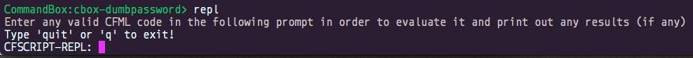

ColdFusion is an **interpreted** programming language which means it can’t run on your processor directly, it has to be fed into a middleman called the Java Virtual Machine in the form of Java Bytecode. 

The ColdFusion engine will convert your markup into byte code and feed it into the Virtual Machine (VM) to execute it.  The benefit to this approach is that you can write ColdFusion code once and, typically, execute it on many different operating systems and hardware platforms.

You can run any ColdFusion script in any Adobe or Lucee server or in the command line with CommandBox.

> Running via CommandBox in the command line will leverage the Lucee CFML engine.

## Running ColdFusion from the Command Line

This is the durable way to write ColdFusion code because you save your instructions into a file. That file can then be backed up, transferred, added to source control, etc.

### An Example ColdFusion File

We might create a file named `hello.cfm` like this:

```js
<cfoutput>Hello from CFML Land!</cfoutput>
```

Then we could run the program like this `box hello.cfm` and get the following result:

```
Hello from CFML Land!
```

> When you run `box hello.cfm` you’re actually loading the CFML instruction set engine (Lucee) and executing the code.

## CommandBox REPL

CommandBox sports a ColdFusion Read Eval Print Loop interface or most commonly know as REPL.  The REPL is like a programming calculator, input in output out.  It will execute ColdFusion instructions and give you feedback on syntax and results.  To start a REPL we must go into the CommandBox shell by typing just `box` or opening the `box` binary.

Once in the CommandBox prompt type `repl` and you will be placed in REPL mode:




