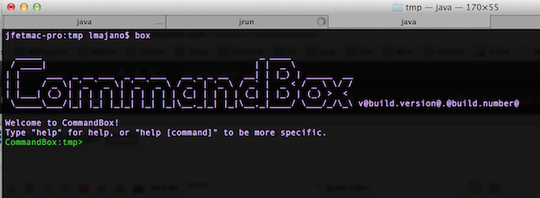

# Overview


CommandBox is an amalgamation of many different tools and borrows
concepts from NPM, Grunt/Gulp, Maven, Bower, and Node. Features include:

-   Command Line for ColdFusion (CFML)
-   Operation System integration for executing commands
-   Ability to create and execute commands built using ColdFusion (CFML)
-   ForgeBox integration for cloud package management and installations
-   ColdBox Platform, TestBox, and ContentBox CMS Integrations
-   Integrated servlet server with rewrite capabilities
-   Ability to create command recipes and execution
-   REPL (Read-Evaluate-Print-Loop) console for immediate ColdFusion
    (CFML) interaction
-   Ability to interact with user via CLI and create workflows and
    installers
-   Ability to execute workflows and tasks
-   Built-in Help system

## Installation

CommandBox is a Java-based executable that will run on most recent desktop operating systems (Linux, Mac OS X, Windows). Since it is a command line tool that uses a shell interface, it does not even require an operating system using a GUI. Below is a simple guideline to get you up and running, but an [in-depth guide](https://commandbox.ortusbooks.com/content/setup/setup.html) can be found here: https://commandbox.ortusbooks.com/content/setup/setup.html

### Requirements

* 256MB+ RAM
* 250MB+ free hard drive space
* Multi-core CPU recommended
* JRE/JDK 7+

### Download

If you already have a Java JRE installed level 1.7 or higher (and set in your environment variables) you can [download](http://www.ortussolutions.com/products/commandbox#download) the non-JRE version for your Operating System. If you don't have a JRE installed or aren't sure, we would recommend you [download](http://www.ortussolutions.com/products/commandbox#download) the version with a JRE included.

Regardless of where you place the **box** binary, the first time you execute it, a `.CommandBox` folder will be created in your user's home directory and CommandBox will be extracted into that location. If you delete this directory, it will be replaced the next time the CommandBox executable is run. 



#### Windows

Unzip the executable **box.exe** and just double click on it to open the shell. When you are finished running commands, you can just close the window, or type `exit`.

>**Hint** You can make the `box.exe` available in any Windows
terminal by adding its location to the `PATH` system environment
variable. See http://www.computerhope.com/issues/ch000549.htm


#### Homebrew (Mac)

[Homebrew](http://brew.sh) is a great Mac package manager, it can easily install and keep
your CommandBox installation up to date (even binary releases), just run the following for stable releases:

```bash
brew install commandbox
```

To stay with current bleeding edge releases use the following:

```bash
brew tap ortus-solutions/boxtap
brew tap-pin ortus-solutions/boxtap
brew install --devel commandbox
```

Then run the `box` binary to begin the one-time unpacking process.

Versions will be installed in `/usr/local/Cellar/commandbox`.  To switch between versions, simply use `brew switch commandbox [version number]`


#### Manual Linux/Mac

Unzip the binary **box** and just double click on it to open the shell terminal. When you are finished running commands, you can just close the window, or type `exit`.

>**Hint** You can place the binary in your `/usr/bin` or `/usr/local/bin` directory so it can be available system-wide via the `box` command in any terminal window.

#### Linux apt-get

Run the following series of commands to add the Ortus signing key, register our Debian repo, and install CommandBox.

```bash
gpg --keyserver keys.gnupg.net --recv-key 6DA70622
gpg -a --export 6DA70622 | sudo apt-key add -
echo "deb http://downloads.ortussolutions.com/debs/noarch /" | sudo tee -a /etc/apt/sources.list.d/commandbox.list
sudo apt-get update && sudo apt-get install commandbox
```

#### Linux yum

Add the following to: `/etc/yum.repos.d/commandbox.repo`

```
[CommandBox]
name=CommandBox $releasever - $basearch
failovermethod=priority
baseurl=http://downloads.ortussolutions.com/RPMS/noarch
enabled=1
metadata_expire=7d
gpgcheck=0
```

Then run a `sudo yum install commandbox` and be up and running

## Getting Started

We have created a small [getting started guide](https://commandbox.ortusbooks.com/content/getting_started_guide.html) that will give you enough skills to move forward with any CommandBox development.  You can find it here: https://commandbox.ortusbooks.com/content/getting_started_guide.html