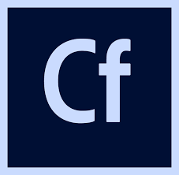

# What is ColdFusion \(CFML\)

ColdFusion Markup Language &lt;CFML&gt; is a dynamic web programming language, which is especially suited for new developers as it was written to make a programmer's job easy and not care if the computer's job is hard. ColdFusion's main goal is to be a rapid application development scripting language and middleware. It integrates with many technologies to provide you with an out-of-the-box language that makes things **easy**. In this brief introduction we'll look at key language features you need to get started.

## Going Deep

ColdFusion \(CFML\) is an interpreted and [dynamic ECMA Script like language](https://en.wikipedia.org/wiki/Dynamic_programming_language) that compiles to [Java Bytecode](https://en.wikipedia.org/wiki/Java_bytecode) directly, thus running in the Java Virtual Machine \(JVM\) and in almost every operating system. Implementations of the language are mostly done by two parties: [Adobe ColdFusion](http://www.adobe.com/products/coldfusion-family.html) \(Commercial\) and [Lucee Server](http://lucee.org/) \(Free & Open Source\) and saw its beginnings in 1995. It is a mature and modern language and development platform. You can discover all the versions here: [https://cfdocs.org/coldfusion-versions](https://cfdocs.org/coldfusion-versions)

## Developing with ColdFusion

All examples shown in this book will be done leveraging CommandBox as the de-facto standard for ColdFusion \(CFML\) development.

[CommandBox](https://www.ortussolutions.com/products/commandbox) is a standalone, native tool for Windows, Mac, and Linux that will provide you with a Command Line Interface \(CLI\) for developer productivity, tool interaction, package management, REPL, embedded ColdFusion/Java server, application scaffolding, and some sweet ASCII art.

## ColdFusion Docs Reference

The best way for discovering the methods, tags and functionality of the ColdFusion language is to leverage [cfdocs.org](https://cfdocs.org/). Make sure you open it and bookmark it.

## IDE - Editors

There are many flavors of IDE's but here are our recommendations.

* [Sublime 3](https://www.sublimetext.com/3)
* [Vistual Studio Code](https://code.visualstudio.com/)
* [Adobe ColdFusion Builder](http://www.adobe.com/products/coldfusion-builder.html)
* [Atom Editor](https://atom.io/)
* [IntelliJ](https://www.jetbrains.com/idea/)


**Tip**: Install the CFML, ColdBox, TestBox and CommandBox plugins for Sublime 3 and VS Code!


