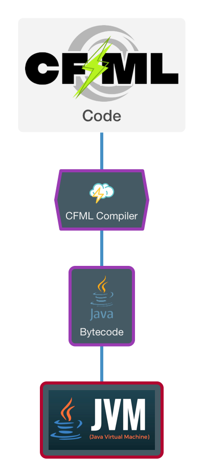

# Instructions & Interpreters

## Dynamic Language

CFML is a **compiled** programming language that can’t run on your processor directly; it has to be fed into a middleman called the Java Virtual Machine in the form of [Java Bytecode](https://en.wikipedia.org/wiki/Java\_bytecode). It is also a **dynamic language (**[**https://en.wikipedia.org/wiki/Dynamic\_programming\_language**](https://en.wikipedia.org/wiki/Dynamic\_programming\_language)**)**, meaning you do not have the **typed** restrictions a compile-time language like Java has. This means you have greater flexibility as the engine **infers** your types. It allows you to do runtime manipulations like method injections, removals, metadata programming, etc., that a typical typed language would not allow. It also allows us to not be in the dreaded compile, build, deploy cycle since the CFML scripts will be evaluated, compiled, and executed all at runtime. No need for re-deploying or annoying restarts.

<figure><figcaption></figcaption></figure>

### Runtime Exceptions

However, with much power comes greater responsibility. There is a lot more potential for runtime exceptions because these exceptions cannot be caught by a compiler at compilation time, as compilation occurs simultaneously with execution. Thus, unit and integration testing become a real asset when building applications under a dynamic language. Wouldn't you know it? We also have a great tool for test-driven and behavior-driven development for ColdFusion: [**TestBox**](https://testbox.ortusbooks.com/) **** ([https://testbox.ortusbooks.com/](https://testbox.ortusbooks.com/))



**TestBox** is a next-generation testing framework for ColdFusion (CFML) that is based on BDD (Behavior Driven Development) for providing a clean, obvious syntax for writing tests. It contains a testing framework, runner, assertions, and expectations library and ships with a mocking and stubbing library.


### Code Portability

The ColdFusion engine will convert your CFML markup into byte code and feed it into the Virtual Machine (VM) to execute it. The benefit of this approach is that you can write ColdFusion code once and, typically, execute it on many different operating systems and hardware platforms.

You can run any CFML script in any Adobe or Lucee server or in the command line with CommandBox.


Running via CommandBox in the command line will leverage the Lucee 5x CFML engine by default. Still, it can be configured easily to run Adobe Coldfusion (ACF), or different versions of either Lucee or ACF.


## Java Integration

CFML is a dynamic language for the JVM. Thus it runs in a full JDK/JRE context. It also provides you with hooks into the Java virtual machine. Meaning you can create and use Java objects natively in CFML. You can even create dynamic proxies and implement Java interfaces natively. Almost **Any** Java library or program can be class loaded and executed in CFML. For further reading, check out the [Java Integration Guide](https://cfdocs.org/java): [https://cfdocs.org/java](https://cfdocs.org/java)

```java
currentFile = createObject( "java", "java.io.File" ).init( getCurrentTemplatePath() );
writeOutput( currentFile.lastModified() );


createDynamicProxy(
  new cbproxies.models.Consumer( arguments.consumer ),
  [ "java.util.function.Consumer" ]
)
```


Adobe and Lucee have the added benefit of being written modularly using [OSGI](https://www.osgi.org/developer/architecture/). This will allow you to build your own Java OSGI bundles and deploy them as well.


## Running CFML from the Command Line

This is a durable way to write CFML code because you save your instructions into a file. That file can then be backed up, transferred, added to source control, etc.

### An Example CFML File

We might create a file named `hello.cfm` like this:

```markup
<cfoutput>Hello from CFML Land!</cfoutput>
```

Then we could run the program like this `box hello.cfm` and get the following result:

```
Hello from CFML Land!
```


When you run `box hello.cfm` you’re actually loading the CFML instruction set engine (Lucee) and executing the code. Please note there is **NO** web server here. It is a pure command-line execution.


## CommandBox REPL

CommandBox sports a CFML **R**ead **E**val **P**rint **L**oop interface or most commonly known as **REPL**. The REPL is like a programming calculator, input in, output out. It will execute CFML instructions and give you feedback on syntax and results. To start a REPL, we must go into the CommandBox shell by typing just `box` or opening the `box` binary.

Once in the CommandBox prompt, type `repl` and you will be placed in REPL mode:


Please note that the REPL in CommandBox opens in **script** mode, not **tag** mode. This means that we must type in instructions that adhere to the ColdFusion scripting or ECMA script-like syntax instead of the tag-based syntax. We will discover more about syntax in the next chapter.

For now, let's type the equivalent in Script syntax:

```javascript
writeOutput( "Hello from CFML Land!" )
```


Boom! We get a magical hello from the CommandBox REPL.


**Tip**: Our REPL supports not only one-line commands but also multi-line commands. Go ahead, try it!


```javascript
if( true ){
    writeoutput( "hello" )
}

echo( "hello" )
```

### Producing Output

In this book, we will primarily be using the REPL or CommandBox for execution.  We will use several functions to produce output during our exercises and code examples.  Here is a list of what we will use to produce output to either the console, the output stream, or a log file.

<table><thead><tr><th>Function</th><th data-type="checkbox">Lucee</th><th data-type="checkbox">Adobe</th><th>Description</th></tr></thead><tbody><tr><td><code>echo()</code></td><td>true</td><td>false</td><td>While <a href="https://cfdocs.org/writeoutput">writeOutput</a> writes to the page-output stream, this function writes to the main response buffer.<br><a href="https://cfdocs.org/echo">https://cfdocs.org/echo</a></td></tr><tr><td><code>systemOutput()</code></td><td>true</td><td>false</td><td>Writes the given object to the output stream<br><a href="https://cfdocs.org/systemoutput">https://cfdocs.org/systemoutput</a></td></tr><tr><td><code>writeOutput()</code></td><td>true</td><td>true</td><td>Appends text to the page-output stream.<br><a href="https://cfdocs.org/writeoutput">https://cfdocs.org/writeoutput</a></td></tr><tr><td><code>writeDump()</code></td><td>true</td><td>true</td><td>Outputs the elements, variables, and values of most CFML objects. Useful for debugging. You can display the contents of simple and complex variables, objects, components, user-defined functions, and other elements.<br><a href="https://cfdocs.org/writedump">https://cfdocs.org/writedump</a></td></tr><tr><td><code>writeLog()</code></td><td>true</td><td>true</td><td>Writes a message to a <a href="https://cfdocs.org/log">log</a> file.<br><a href="https://cfdocs.org/writelog">https://cfdocs.org/writelog</a></td></tr></tbody></table>


`writeDump()` is helpful in the console to visualize complex objects\
`writedump( var=variable, output="console" )`\
``\
`You can also pass complex objects to` systemOuput() `as well.`

