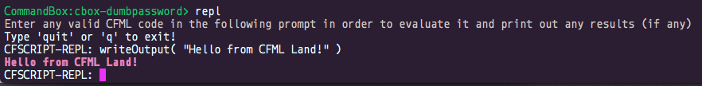

# Instructions & Interpreters

## Dynamic Language

ColdFusion is a **compiled** programming language which means it can’t run on your processor directly, it has to be fed into a middleman called the Java Virtual Machine in the form of [Java Bytecode](https://en.wikipedia.org/wiki/Java_bytecode). It is also a **dynamic language**, meaning you do not have the **typed** restrictions a compile-time language like Java has. This means you have greater flexibility as the engine actually infers the types for you \([Lucee](https://lucee.org/)\) and it allows you to do runtime manipulations like method injections, removals, metadata programming etc that a typical typed language would not allow. It also allows us to not be in the dreaded compile, build, deploy cycle, since the ColdFusion scripts will be evaluated, compiled and executed all at runtime. No need of re-deploying or annoying restarts.

### Runtime Exceptions

However, with much power comes greater responsibility. There is a lot more potential of runtime exceptions due to the fact that these exceptions cannot be caught by a compiler at compilation time, as compilation occurs at the same time as execution. Thus, unit and integration testing become a real asset when building applications under a dynamic language.  Wouldn't you know it, we also have a great tool for test driven and behavior driven development for ColdFusion: [**TestBox**](https://testbox.ortusbooks.com/).



**TestBox** is a next generation testing framework for ColdFusion \(CFML\) that is based on BDD \(Behavior Driven Development\) for providing a clean obvious syntax for writing tests. It contains not only a testing framework, runner, assertions and expectations library but also ships with MockBox, A mocking and stubbing companion. 


### Code Portability

The ColdFusion engine will convert your markup into byte code and feed it into the Virtual Machine \(VM\) to execute it. The benefit to this approach is that you can write ColdFusion code once and, typically, execute it on many different operating systems and hardware platforms.

You can run any ColdFusion script in any Adobe or Lucee server or in the command line with CommandBox.


Running via CommandBox in the command line will leverage the Lucee 5x CFML engine by default.


## Java Integration

ColdFusion is a dynamic language for the JVM, thus it runs in a full JDK/JRE context. It also provides you with hooks into the Java virtual machine. Meaning you can create and use Java objects natively in CFML. You can even create dynamic proxies and implement Java interfaces natively. Almost **Any** Java library or program can be class loaded and executed in CFML. For further reading check out the [Java Integration Guide](https://cfdocs.org/java): [https://cfdocs.org/java](https://cfdocs.org/java)


```java
currentFile = createObject( "java", "java.io.File" ).init( getCurrentTemplatePath() );
writeOutput( currentFile.lastModified() );
```



Lucee has the added benefit that it is written in a modular fashion using [OSGI](https://www.osgi.org/developer/architecture/).  This will allow you to build your own Java OSGI bundles and deploy them as well.


## Running ColdFusion from the Command Line

This is the durable way to write ColdFusion code because you save your instructions into a file. That file can then be backed up, transferred, added to source control, etc.

### An Example ColdFusion File

We might create a file named `hello.cfm` like this:



```markup
<cfoutput>Hello from CFML Land!</cfoutput>
```



Then we could run the program like this `box hello.cfm` and get the following result:

```text
Hello from CFML Land!
```


When you run `box hello.cfm` you’re actually loading the CFML instruction set engine \(Lucee\) and executing the code. Please note, there is **NO** web server here. It is a pure command line execution.


## CommandBox REPL

CommandBox sports a ColdFusion **R**ead **E**val **P**rint **L**oop interface or most commonly know as **REPL**. The REPL is like a programming calculator, input in output out. It will execute ColdFusion instructions and give you feedback on syntax and results. To start a REPL we must go into the CommandBox shell by typing just `box` or opening the `box` binary.

Once in the CommandBox prompt type `repl` and you will be placed in REPL mode:


Please note that the REPL in CommandBox opens in **script** mode and not in **tag** mode. This means that we must type in instructions that adhere to the ColdFusion scripting or ECMA script like syntax instead of the tag based syntax. We will discover more about syntax in the next chapter.

For now, let's type the equivalent in Script syntax:



```javascript
writeOutput( "Hello from CFML Land!" )
```





Boom! We get a magical hello from the CommandBox REPL.


**Tip**: Our REPL not only supports one line commands but also multi-line commands. Go ahead, try it!


