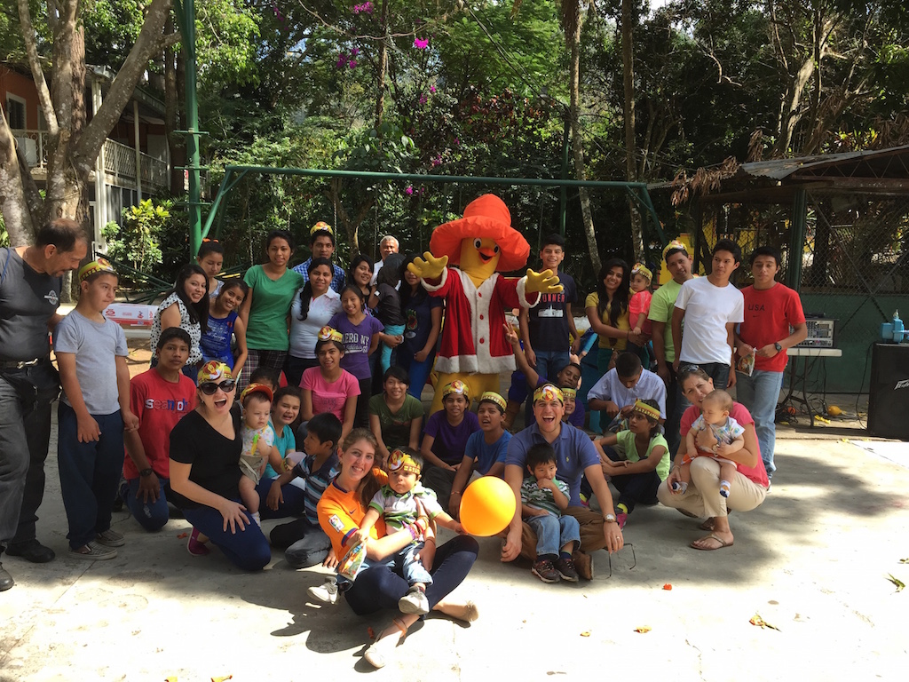

# About This Book

The source code for this book is hosted on GitHub: [https://github.com/ortus-docs/Modern-ColdFusion-CFML-In-100-Minutes](https://github.com/ortus-docs/Modern-ColdFusion-CFML-In-100-Minutes). You can freely contribute to it and submit pull requests. The contents of this book are copyrighted by [Ortus Solutions, Corp](http://www.ortussolutions.com/) and cannot be altered or reproduced without the author's consent. All content is provided _"As-Is"_ and can be freely distributed.‌

* The majority of code examples in this book are done in `cfscript`.
* The majority of code generation and running of examples are done via **CommandBox**: The ColdFusion (CFML) CLI, Package Manager, REPL - [https://www.ortussolutions.com/products/commandbox](https://www.ortussolutions.com/products/commandbox)​

## ‌External Trademarks & Copyrights‌

Flash, Flex, ColdFusion, and Adobe are registered trademarks and copyrights of Adobe Systems

## Notice of Liability

‌The information in this book is distributed **as is**, without warranty. The author and Ortus Solutions, Corp shall not have any liability to any person or entity concerning loss or damage caused or alleged to be caused directly or indirectly by the content of this training book, software, and resources described in it.

## Charitable Proceeds‌

10% of the proceeds of this book will go to charity to support orphaned kids in El Salvador - [https://www.harvesting.org/](https://www.harvesting.org/). So please donate and purchase the printed version of this book; every book sold can help a child for almost two months.‌

## Shalom Children's Home

<figure><figcaption>
Shalom Children's Party!
</figcaption></figure>

The Shalom Children's Home ([https://www.harvesting.org/](https://www.harvesting.org/)) is one of the ministries that are dear to our hearts located in El Salvador. During the 12-year civil war that ended in 1990, many children were left orphaned or abandoned by parents who fled El Salvador. The Benners saw the need to help these children and received 13 children in 1982. Little by little, more children came on their own, churches and the government brought children to them for care, and the Shalom Children’s Home was founded.

Shalom now cares for over 80 children in El Salvador, from newborns to 18 years old. They receive shelter, clothing, food, medical care, education, and life skills training in a Christian environment. The home is supported by a child sponsorship program.‌

We have supported Shalom since 2010; it is a place of blessings for many children in El Salvador who either have no families or have been abandoned. This is a good earth to seed and plant.

